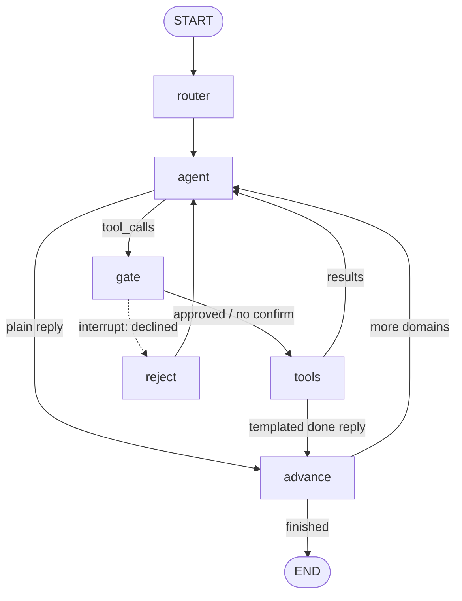

# Jarvis Agent Loop (LangGraph)

The agent loop lives in `src/jarvis/agent/graph.py` (`build_graph`). It is a LangGraph `StateGraph`
compiled with a Postgres checkpointer (`AsyncPostgresSaver`, wired in `src/jarvis/main.py`).
Telegram and voice share one conversation thread and one `asyncio.Lock`, so only one graph step runs at a time.

## State

| Field | Purpose |
|---|---|
| `messages` | Chat history; the `add_messages` reducer appends |
| `domains` | Ordered plan, e.g. `["gmail", "calendar"]` |
| `idx` | Position in `domains` |
| `approved` | The gate cleared the current tool step |
| `client_actions` | Phone-side actions (alarms, timers...) collected for the device |
| `read_untrusted` | Email or web content has been read this turn |

## Graph



```
                  ┌───────┐
                  │ START │
                  └───┬───┘
                      ▼
                 ┌────────┐
                 │ router │  pick domains, set idx=0
                 └───┬────┘
                     ▼
      ┌───────────►┌───────┐◄──────────────────────────┐
      │            │ agent │  LLM for domains[idx]     │
      │            └───┬───┘                           │
      │   last msg has │ tool_calls?                   │
      │       ┌────────┴─────────┐                     │
      │      no                 yes                    │
      │       │                  ▼                     │
      │       │             ┌────────┐                 │
      │       │             │  gate  │ confirm needed? │
      │       │             └─┬────┬─┘                 │
      │       │  no confirm / │    │ interrupt()        │
      │       │  user approved│    │ user declines      │
      │       │               ▼    ▼                    │
      │       │          ┌───────┐ ┌────────┐           │
      │       │          │ tools │ │ reject │───────────┘
      │       │          └───┬───┘ └────────┘  (reject→agent)
      │       │              │
      │       │   last msg is AIMessage?
      │       │   (templated "done" reply)
      │       │      ┌───────┴────────┐
      │       │     yes               no
      │       ▼      ▼                │
      │    ┌─────────┐                │
      │    │ advance │ idx += 1       │
      │    └────┬────┘                │
      │         │                     │
      │   idx < len(domains)?         │
      │    ┌────┴─────┐               │
      │   yes        no               │
      │    │          ▼               │
      └────┘      ┌─────┐             │
   (next domain)  │ END │             │
                  └─────┘             │
      ◄───────────────────────────────┘
      (tools→agent: feed results back to LLM)
```

## Edges

| From | To | Kind | Condition |
|---|---|---|---|
| START | router | static | always |
| router | agent | static | always |
| agent | gate | conditional (`after_agent`) | last message has `tool_calls` |
| agent | advance | conditional | no tool calls (final text reply) |
| gate | tools | dynamic (`Command(goto)`) | no gated calls, or user approved |
| gate | reject | dynamic (`Command(goto)`) | user declined the interrupt |
| reject | agent | static | always; LLM sees "Cancelled by the user" |
| tools | agent | conditional | normal case: LLM reads tool results |
| tools | advance | conditional | last message is an `AIMessage` (templated done-reply, LLM wrap-up skipped) |
| advance | agent | conditional (`after_advance`) | `idx < len(domains)` |
| advance | END | conditional | all domains done |

`gate` has no static outgoing edge: it routes itself with `Command(goto=...)`, so it does not show up in `add_edge` calls.

## Nodes

- **router**: Picks domains (`calendar, tasks, gmail, phone, memory, notes, research, chat`).
  `keyword_domain` regex runs first; exactly one hit skips the LLM. Otherwise the "fast" model gets
  `ROUTER_PROMPT` and `parse_domains` cleans the answer. A multi-domain request becomes an ordered plan.
- **agent**: One LLM call for `domains[idx]`. The domain supplies prompt, model tier and tools
  (`DOMAINS`, `registry.lc_tools`). Memories and local time are added to the system prompt.
  Voice turns use the fast tier except for gmail and research. History is trimmed by `window` (last 40)
  and `repair_tool_gaps` answers orphan tool calls.
- **gate**: Human-in-the-loop. If a tool needs confirmation (`registry.needs_confirm`), or is flagged
  `confirm_after_untrusted` and untrusted content was seen, it calls `interrupt(payload)`. The graph pauses
  and the checkpoint is saved. Confirmed writes must be proposed alone in their step.
- **tools**: Runs approved calls in threads. `ReauthRequired`, `HttpError` and bad arguments become error JSON
  for the LLM. Untrusted output is wrapped in `<untrusted_email>` / `<untrusted_web>` (closing tags escaped).
  Every call writes an audit row (email bodies redacted). If every call was a confirmed write with a `done`
  template, it emits a canned reply and skips the LLM.
- **reject**: User declined. Adds a `ToolMessage("Cancelled by the user...")` per call, then back to `agent`.
- **advance**: `idx += 1`. Loops to the next domain or ends.

## Interrupt and resume

1. `gate` calls `interrupt(...)`; the run stops and state is checkpointed to Postgres.
2. The channel (Telegram `THREAD`, voice `VOICE_CFG`) reads `graph.aget_state(cfg).interrupts` and shows a confirm card.
3. The user's answer resumes the run: `graph.ainvoke(Command(resume=True | False), cfg)`.

## Safety design

- Confirm gate on side-effecting tools.
- Extra confirm after reading untrusted third-party content (prompt-injection defense).
- Audit row for every tool call.

## Example: "add that booking email to my calendar"

1. `router`: LLM returns `gmail, calendar`, `idx=0`.
2. `agent` (gmail) calls `read_email`. `gate` finds no confirm needed, `tools` runs it, the result is wrapped
   `<untrusted_email>` and `read_untrusted=True`. Back to `agent`, which summarizes with no tool calls. `advance` sets `idx=1`.
3. `agent` (calendar) calls `create_event`. `gate` sees a write plus untrusted content, so it calls `interrupt`
   and the confirm card goes to the user.
4. Yes: `tools` runs it, `done` template, `advance` sets `idx=2`, END.
   No: `reject`, then `agent` asks what the user wants instead.
